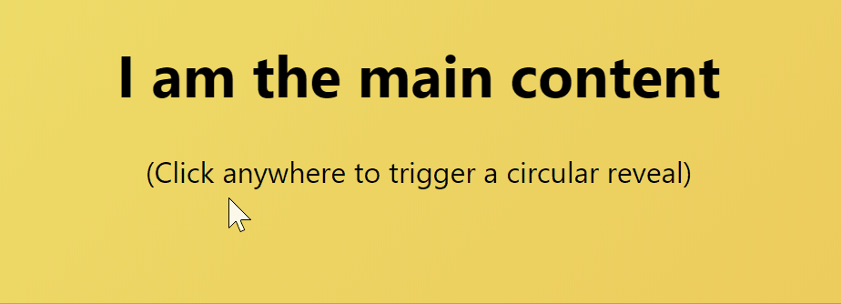
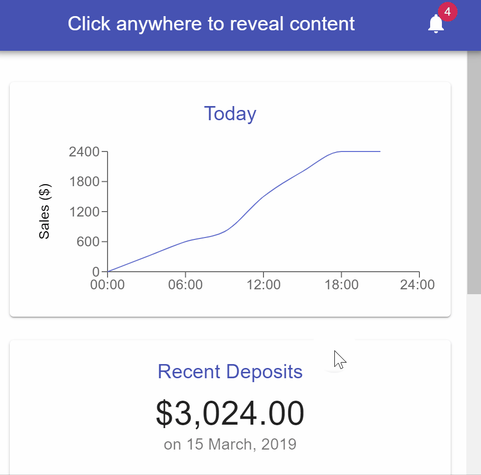

[](https://travis-ci.com/nosachamos/react-circular-reveal)
[](https://codecov.io/gh/nosachamos/react-circular-reveal)

[](https://github.com/prettier/prettier)


**react-circular-reveal** allows you do quickly and easily add Material Design's "Circular Reveal" animation in your web app.

<p align="center">

</p>
<br/>


# Installation

```sh
yarn add react-circular-reveal
```

or

```sh
npm install react-circular-reveal --save
```

# Usage

The circular reveal panel manages two components: one that is displayed by default, and one that is "revealed" on top of
it when the circular reveal animation takes place. 

```jsx
<CircularRevealPanel
        reveal={isOpened}
        revealContent={
            <div>
                {/* When the reveal animation happens, I am displayed beautifully through a
                circular reveal animation and, as long as I am not transparent, will cover
                the div below */}
            </div>
        }
    >

    <div>
        {/* I am displayed by default, and covered by the `revealContent` element when the
        reveal animation takes place */}
    </div>
</CircularRevealPanel>
```

#### Key points:

 - Set `reveal` prop to `true` to have the reveal content be displayed on top of the default content.

 - The reveal animation will by default open and close towards the current mouse location, which is automatically tracked fo you.
 In the example above, you don't need to do anything to make it look like the content opened from the tip of the mouse cursor. Awesome!
 
 - Everything can be customized so you can be creative and build impressive user interfaces that are only normally seen in native applications.


## Example

```jsx
<CircularRevealPanel
    reveal={isOpened}
    revealContent={
        <div className={'revealed'} onClick={() => setOpened(false)}>
            <h2>I am revealed with a circular animation.</h2>
            <span>(Click anywhere to close)</span>

            <h1>Awesome!</h1>
        </div>
    }
>

    <div className={'content'} onClick={() => setOpened(true)}>
        <h1>I am the main content</h1>
        <span>(Click anywhere to trigger a circular reveal)</span>
    </div>

</CircularRevealPanel>
```

Results in:




# Props

The `CircularRevealPanel` component accepts several props that can be used to setup and customize it's behavior.

#### Props you will definitely need

| Prop  |     Type     |  Required  | Default | Description |
| ----- | ---------------- | ---- | --- | ----------- |
| `revealContent` | `React Node` | yes | N/A |Receives the content to be revealed through the circular reveal animation. |
| `reveal` | `boolean` | no | `false` |A value indicating whether to display the reveal content or not. |

#### Props you probably won't need

| Prop  |     Type     |  Required  | Default | Description |
| ----- | ---------------- | ---- | --- | ----------- |
| `revealCurtainContent` | `React Node` | no | `undefined` | Only needed for advanced customizations, this prop may be used to insert elements within the reveal curtain. |
| `speed` | `string` or `function` | no | `normal` | The valid string values are `very slow`, `slow`, `normal` (default), `fast`. Most likely these will suffice. For advanced customizations, see below. |
| `contentMinWidth` | `number` | no | 500 | The minimum width for the content to be revealed, in pixels. This prevents the content from appear to rearrange as the curtain expands. |

# Events

The `CircularRevealPanel` component accepts an `onChange` event handler which is invoked when the opening and closing operations start and finish. It gives you access to the raw HTML elements used to 

The event object argument contains three properties of interest:

-  The`type` property which kind of event this is. It can be of the following: `CURTAIN_OPENING`, `CURTAIN_OPENED`, `CURTAIN_CLOSING`, `'CURTAIN_CLOSED`.
- The `curtainElemRef` and `revealContentRef` the properties are references to the raw HTML div elements used as a reveal curtain and reveal content, respectively. Only needed for advanced customizations.

Assume this following setup:

```jsx
    const handleOnChange = useCallback((e: CurtainEvent) => {
        console.log('EVENT TYPE: ' + e.type);
    }, []);
    
    <CircularRevealPanel
            onChange={handleOnChange}
            revealContent={
                ...
            }
        >
    
        ...
        
    </CircularRevealPanel>
```

In this case, opening and closing the reveal content would result in four console log print outs:

```sh
EVENT TYPE: CURTAIN_OPENING
EVENT TYPE: CURTAIN_OPENED
EVENT TYPE: CURTAIN_CLOSING
EVENT TYPE: CURTAIN_CLOSED
```


# Advanced Customizations

## Customizing the opening/closing `speed`

The speed with which to open or close the circular reveal animation. Can be a `string` or a `function`.

The valid string values are `very slow`, `slow`, `normal` (default), `fast`. Most likely these will suffice.

If you find however that you need to further customize it, you may pass in a function which will be invoked on every step of the reveal animation and must return the next size for the *reveal curtain* (the circular region that displays the reveal content). 

This function is given two parameters - the current size of the reveal curtain, and whether the curtain is opening or closing.

For reference, this is the function that implements the `normal` speed:

```jsx
const resizeCurtainFunction = (size, opening) => {
    return opening ? size + Math.max(size/3, 5) : size - Math.max(size/3, 5);
};

<CircularRevealPanel
        reveal={isOpened}
        speed={resizeCurtainFunction}
        revealContent={
            ...
        }
    >

    ...
    
</CircularRevealPanel>
```

## Overriding styles

The styles of all three elements composing the `CircularRevealPanel` component can be overridden to further customize it.

To do so, add or override styles to the following classes:

- `circular-reveal__overlay` - the class of the outermost container that holds both de default content as well as the reveal content. 
- `circular-reveal__revealCurtain` - the class of the element that serves as our circular reveal curtain.
- `circular-reveal__revealContent` - the class of the element that holds the reveal content.

Common use cases for overriding or extending such these styles include specifying a `z-index` and setting a `height` so that they will
cover the entire screen.


# Demo app

This project includes a demo app where this component can be seen in action.

To run the demo app locally, clone this repository, then open the terminal and navigate to the location where you closed it. Finally, run `npm start` from within the `demo=app` folder, then open the address `http://localhost:3000/` on your browser.




# Contributing

Contributions are very welcome!

We follow the "fork-and-pull" Git workflow.

1. **Create a Fork and clone it**
2. **Modify the Code**
3. **Push your Changes**
4. **Create a Pull Request**

## License

MIT

---

Created and maintained by **[`Eduardo Born`](http://github.com/nosachamos)** with ❤ and coffee
